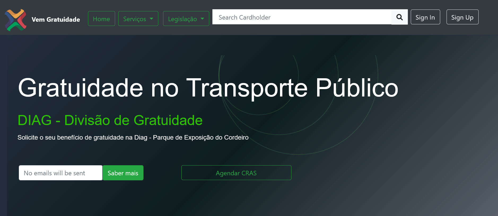

# Project STPP - Vem Gratuidade
#### Video Demo: <https://youtu.be/Dw_LwJXNPeo](https://www.youtube.com/watch?v=ppjT98VvDBA>

## Project Overview
STPP - Vem Gratuidade is a Web-based Application designed to address the specific needs of indiviuals with free tickets cards, such as those with disabilities, elderly individuals and chidren.
The primary purpose is to manage the unlocking process for cards that have been suspended due to rule violations.

To facilitate travel on the metro or bus public system, individuals require a Public Transportation Card (Catao Vem). 
### Browse through the website, register, log in and start porcessing unlocking requests.

## Click **Quick Guide** link at the top left of the screen and view the steps to complete a unlock request submitted by a transport user.  

### Distinctiveness and Complexity

**Why the Project is Distinct:**
This project stands out for its direct response to a real and specific issue within the public transportation system. It tackles the complexity of enforcing laws related to freee benefits by incorporating dynamic rules thta vary based on card type, frequency of rule violarions, and card holder eligibility.

**Complex Aspects:**
The complexity lies in the nuanced enforcement of four infractiions, each with its own penalty. The rules for unlocking the card are dynamically generated based on the type of infringement, providing a tailored agreement for the cardholder.

### File Contents

- **JavaScript File:** 
Contains logic for law rule application to display data accurately.
- **Python Files:** 
Encompass server-side logic for entering and retrieving card and law rules data, managing unlock dates, request statuses and card statuses. Includes dynamic construction of agreement terms based on cardholder and law information.
- **Django Models:** 
Include the necessary database structures for authenticating staff, searching cardholder information, and generating agreements for card users to sign.
- **HTML and CSS Files:** 
Comprise the user interface code for creatig an one-page app and navigating through the unlocking process.

### How to Run the Application

1. **Clone the Repository**

git clone https://github.com/martinsbtp/martinsbtp.git

2. **Install dependencies**

pip install -r requirements.txt

3. **Run the Application**

python manage.py runserver

4. **Access the Application**
open a web browser and go to http://localhost:8000

## Application Usage

1. **Enployee Registration:** Employees sign up for authentication access.
2. **Cardholder Status Check:**
- If Locked:
    - Cardholder requests unlocking.
    - Signs the agreement (PDF).
    - Receives unlocking date and proceedings number (protocolo) for reference.
- If Unlocked:
    - Cardholder can request a new card copy (in future versions).
			

## FrontPage Area - Logged Out

**Explore the website:**

The user can see the main area with marketing campaings and Login and Signup buttons

## Inside User Interface Area - Logged In

**Explore the options:**

**The Lateral Menu** - List of links and stats information about the services provided and number of daily and monthly requests

**The content area** - Search cardholder status by date of birth, mother name, cardholder name, CPF and procedings number (protocolo)

**The profile area** - Shows the requests statuses and card statuses, the cardholder info and services options for that specific card, as well as the requests history by date.

**Generating Terms of Aggrement** - As soon as the cardholder requests the unlocking procedure, a term of agreement is dinamically generated for the user to sign.

**The reports area** - Shows options for generating reports and exporting pdf files.

**The Help area** - Shows how to use the app and the minimum requirements for the app to run propperly.

**Contact form to report a bug or request IT Suport** - Shows how to use the app and the minimum requirements for the app to run propperly.

---
### Admin
---

**Admin access** - Admin interface for the IT support to change or update laws rules and user permissions

### Limitations

We need to integrate the STPP application with the State of Pernmabuco's cloud system. 
Card copies requests rules is not available, due to payment system not integrated with the State Departmente system yet.
The application works with sensitive data sent by the data provider's servers. These data are not available for investigation. On the other hand, all legislation can be consulted during beta tests.
Content Management is avalilabe for changing texts in your user main main page only. In future versions, a complete content management will be implemented as well as a news feed.

---
### What's Next
---

Mobile app to request services without visiting a public agency. 

Requesting card copies

Obtaining extra free tickets

Challenging suspensions through administrative proceedings 

Stotring all documents in the cloud

Chatroom.

State Department Online System Integration for payments

Speech Recognition.

Help and Tutorials.

Json Search Field.

Dark Theme / Look and Feel Options.

Full Login page with email confirmation.

## License Information

This project is licensed under the [MIT License](LICENSE.txt)

## Secutity Documentation

### Reporting Security Issues

If you discover a security risk within our application, please do not disclose it publicly. Instead, report  directly to our security team via email at martinsleiria@gmail.com. We appreciate your responsible disclosure.

### Additional Information

The project aims to address potential legal issues related to card locking and unlocking systems. It envisions future versions allowing cardholders to use a mobile app for unlocking, requesting card coies, challenging suspensions, and storing documents in the cloud.

## Introduction

To use public transportation, individuals require a Cartão Vem, which is freely provided for children, elderly individuals, and people with disabilites. Violations of usage lead to card suspension, with penalties varying based on the number of infractiions. This applications facilitates the monitoring and enforcement of suspension periods

## Problem to Solve or Mitigate

The project aims to address potential legal issues arising from card locking and unlocking systems. The focus i son preventing unjust suspensions, especially for elderly individuals an people with disabilities who may seek justice for damages caused by card suspensions.

## Test Version (CS50) Version)

The test version serves as a platform for the Consortium Agency to collect agreement signatures, provide instructions on locking/unlocking procedures, and set unlock dates according to suspension rules. Daily reports are generated and sent to operators and agendy staff to track unlocking requests and identify infriging cards.

## New versions

Future versions aim to allow cardholders to install a mobile app, accept agreement terms online, and request unlocking services without visiting a public agency. This approach reduces agency size and associated costs.
Additional features include requesting card copies, obtaining extra free tickets, challenging suspensions through administrative proceedings, and sotring all documents in the cloud.

